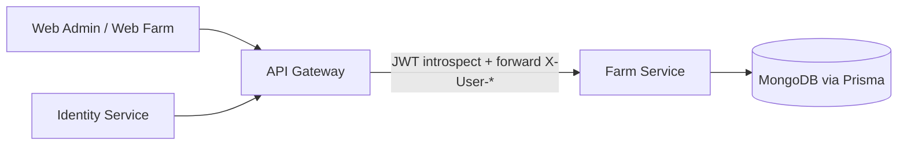
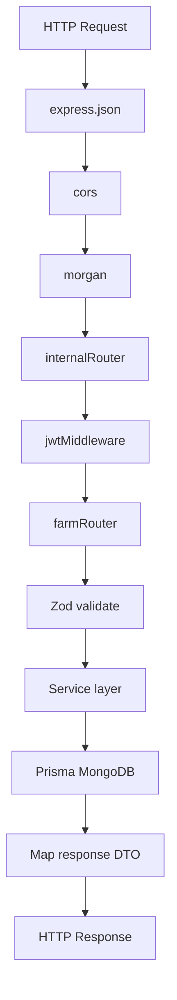
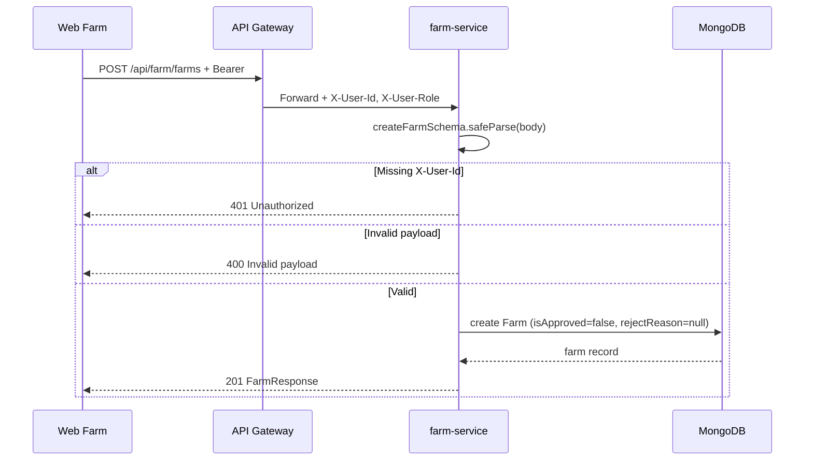
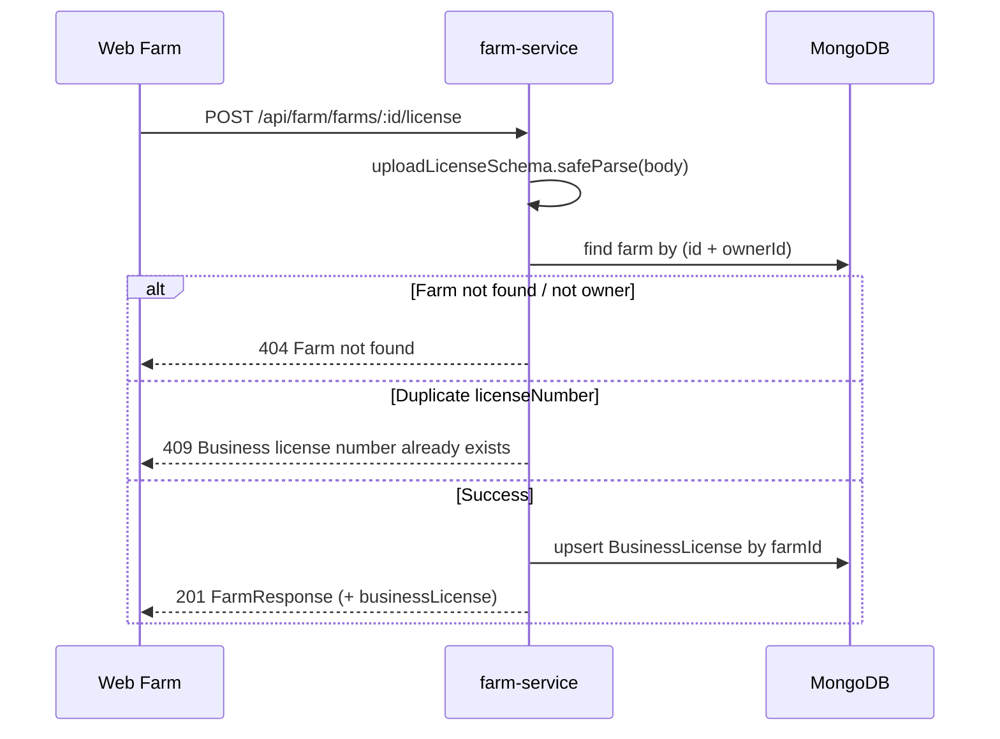
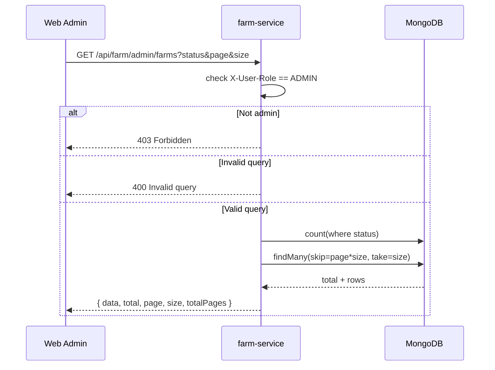
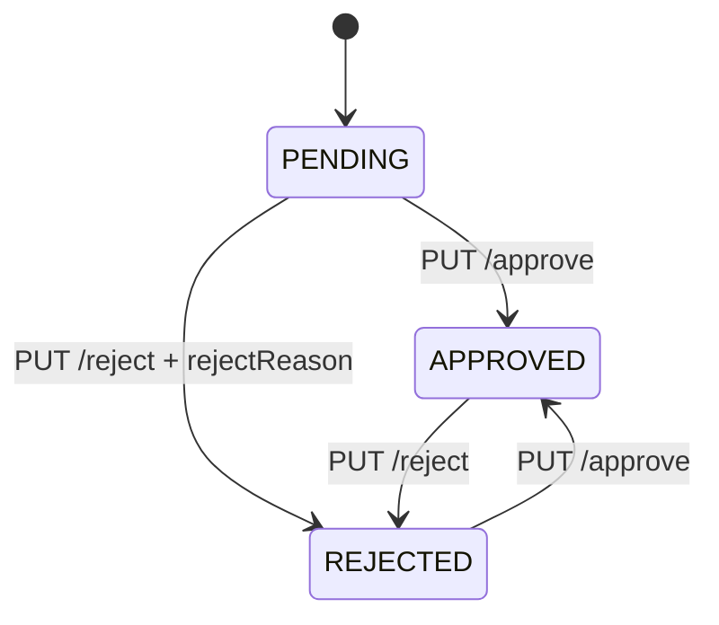

# FARM SERVICE FLOW (Visual)

## 1) Scope

Tai lieu nay mo ta luong chay **module Farm** trong `services/farm-service`:
- Dang ky farm
- Cap nhat farm
- Upload business license
- Admin duyet / tu choi farm
- Admin xem danh sach farm co phan trang

Port mac dinh: `8082`  
Prefix API: `/api/farm/...`

## 2) Big picture



Ghi chu:
- Farm Service **khong tu parse Bearer token**.
- Farm Service doc user context tu header do Gateway forward:
  - `X-User-Id`
  - `X-User-Role`

## 3) Request pipeline in farm-service



## 4) Endpoint map (Farm)

### Farmer endpoints
- `POST /api/farm/farms` tao farm moi
- `GET /api/farm/farms` lay farm cua owner
- `PUT /api/farm/farms/:id` cap nhat farm cua owner
- `POST /api/farm/farms/:id/license` upload/cap nhat business license

### Admin endpoints
- `GET /api/farm/admin/farms?status=&page=&size=` lay danh sach farm (pagination)
- `GET /api/farm/admin/farms/:id` lay chi tiet farm
- `PUT /api/farm/admin/farms/:id` admin cap nhat farm
- `DELETE /api/farm/admin/farms/:id` admin xoa farm
- `PUT /api/farm/admin/farms/:id/approve` admin duyet farm
- `PUT /api/farm/admin/farms/:id/reject` admin tu choi farm

## 5) Main flows

### 5.1 Farmer creates farm



### 5.2 Upload business license



### 5.3 Admin list farms (pagination)



### 5.4 Admin approve / reject



Business rule hien tai:
- `APPROVED` <=> `isApproved = true`, `rejectReason = null`
- `REJECTED` <=> `isApproved = false`, `rejectReason != null`
- `PENDING` <=> `isApproved = false`, `rejectReason = null`

## 6) Validation and errors

- `401` khi thieu `X-User-Id` cho owner endpoints.
- `403` khi role khong phai `ADMIN` cho admin endpoints.
- `400` khi payload/query fail Zod.
- `404` khi farm khong ton tai.
- `409` khi trung `licenseNumber` business license.
- `500` cho unhandled error.

## 7) Response shape (admin list)

`GET /api/farm/admin/farms` tra ve:

```json
{
  "data": [
    {
      "id": "...",
      "name": "...",
      "ownerId": "...",
      "isApproved": false,
      "rejectReason": null,
      "address": "...",
      "province": "...",
      "area": 12.5,
      "createdAt": "...",
      "updatedAt": "...",
      "businessLicense": null
    }
  ],
  "total": 120,
  "page": 0,
  "size": 20,
  "totalPages": 6
}
```

## 8) Quick test checklist

1. Tao farm moi bang account farmer -> ky vong `201` va `isApproved=false`.
2. Upload license cho farm vua tao -> ky vong `201`.
3. Dang nhap admin, list `status=PENDING` -> thay farm vua tao.
4. Approve farm -> farm chuyen `APPROVED`.
5. Reject farm khac voi `rejectReason` -> farm vao tab `REJECTED`.
6. Thu query `page=1&size=10` -> ket qua co metadata pagination dung.
